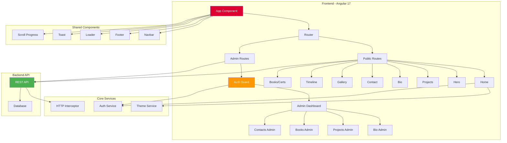

<div align="center">

# 🚀 Portfolio UI - Modern Angular Portfolio Application


### ✨ A stunning, feature-rich portfolio application with admin panel, modern animations, and 3D graphics

[🌟 Features](#-features) • [🏗️ Architecture](#️-architecture) • [🚀 Quick Start](#-quick-start) • [📖 Documentation](#-documentation) • [🤝 Contributing](#-contributing)

</div>

---

## 📋 Table of Contents

- [Overview](#-overview)
- [Features](#-features)
- [Architecture](#️-architecture)
- [Technology Stack](#-technology-stack)
- [Project Structure](#-project-structure)
- [Getting Started](#-getting-started)
- [Configuration](#️-configuration)
- [Development](#-development)
- [Deployment](#-deployment)
- [API Integration](#-api-integration)
- [Contributing](#-contributing)
- [License](#-license)

---

## 🎯 Overview

**Portfolio UI** is a modern, responsive web application built with Angular 17 that showcases your professional portfolio in an elegant and interactive way. It features a comprehensive admin panel for content management, beautiful animations powered by GSAP, stunning 3D graphics with Three.js, and seamless backend integration.

### 🌟 Why This Portfolio?

- **🎨 Modern Design** - Clean, professional, and responsive UI/UX
- **⚡ Lightning Fast** - Built with Angular's latest standalone components
- **🔐 Secure Admin Panel** - Complete CMS for managing your portfolio content
- **🎭 Stunning Animations** - Smooth transitions and effects with GSAP
- **🌈 3D Graphics** - Interactive Three.js visualizations
- **📱 Mobile First** - Fully responsive across all devices
- **🚀 Production Ready** - Optimized and ready for deployment

---

## ✨ Features

### 🎨 Frontend Features

#### 🏠 Public Portfolio Pages
- **Hero Section** - Eye-catching landing with 3D animations
- **Bio/About** - Personal introduction and background
- **Projects Showcase** - Display your work with detailed descriptions
- **Timeline** - Career journey and milestones
- **Books & Certifications** - Educational achievements
- **Gallery** - Visual portfolio with lightbox
- **Contact Form** - Integrated contact system

#### 🎬 User Experience
- **Smooth Animations** - GSAP-powered transitions
- **Route Animations** - Seamless page transitions
- **Scroll Progress** - Visual feedback while scrolling
- **Loading States** - Professional loader component
- **Toast Notifications** - User feedback system
- **Theme Support** - Light/Dark mode switching
- **Responsive Design** - Mobile, tablet, and desktop optimized

### 🔐 Admin Panel Features

#### 📊 Content Management
- **Bio Management** - Update personal information
- **Project CRUD** - Create, read, update, delete projects
- **Books Management** - Manage book collection
- **Contact Messages** - View and manage contact submissions
- **Authentication** - Secure login system
- **Route Guards** - Protected admin routes

---

## 🏗️ Architecture

### System Architecture Diagram



### Component Flow Diagram

```
┌─────────────────────────────────────────────────────────────┐
│                        App Component                         │
│  ┌────────────┐  ┌────────────┐  ┌────────────────────┐    │
│  │   Navbar   │  │   Loader   │  │  Scroll Progress   │    │
│  └────────────┘  └────────────┘  └────────────────────┘    │
└─────────────────────────────┬───────────────────────────────┘
                              │
                    ┌─────────▼─────────┐
                    │    Router Outlet   │
                    └─────────┬─────────┘
                              │
                ┌─────────────┴─────────────┐
                │                           │
         ┌──────▼──────┐           ┌───────▼────────┐
         │   Public    │           │     Admin      │
         │   Routes    │           │    Routes      │
         └──────┬──────┘           └───────┬────────┘
                │                          │
    ┌───────────┼───────────┐         ┌───┴────┐
    │           │           │         │  Auth  │
┌───▼───┐  ┌───▼───┐  ┌───▼───┐    │  Guard │
│ Hero  │  │Projects│ │Contact│    └───┬────┘
└───────┘  └───────┘  └───────┘        │
                                   ┌────▼─────┐
                                   │  Admin   │
                                   │  Panel   │
                                   └──────────┘
```

### Data Flow Architecture

```
┌──────────────┐
│   User UI    │
└──────┬───────┘
       │
       │ HTTP Requests
       ▼
┌──────────────────┐
│  HTTP Interceptor │ ◄── Adds Auth Headers
└──────┬───────────┘
       │
       │ Proxied Requests
       ▼
┌──────────────────┐
│   Proxy Config   │ ◄── /api → Backend
└──────┬───────────┘
       │
       ▼
┌──────────────────┐
│  Backend API     │
│ (ASP.NET)        │
└──────┬───────────┘
       │
       ▼
┌──────────────────┐
│    Database      │
└──────────────────┘
```

---

## 💻 Technology Stack

### Frontend Core
| Technology | Version | Purpose |
|-----------|---------|---------|
|  | 17.3.0 | Core Framework |
|  | 5.4.5 | Programming Language |
|  | 7.8.0 | Reactive Programming |
|  | Latest | Styling |

### UI & Animation
| Technology | Version | Purpose |
|-----------|---------|---------|
|  | 3.12.5 | Animation Library |
|  | 0.162.0 | 3D Graphics |
| Angular Animations | 17.3.0 | Native Animations |

### Development Tools
| Tool | Purpose |
|------|---------|
|  | Project Management |
|  | Runtime Environment |
|  | Package Management |

### Deployment
| Platform | Purpose |
|----------|---------|
|  | Hosting Platform |
| Backend API | http://zainportfilo.runasp.net |

---

## 📁 Project Structure

```
portfolio-ui/
│
├── 📁 src/
│   ├── 📁 app/
│   │   ├── 📁 core/                    # Core functionality
│   │   │   ├── 📁 guards/              # Route guards
│   │   │   │   └── auth.guard.ts       # Authentication guard
│   │   │   ├── 📁 interceptors/        # HTTP interceptors
│   │   │   ├── 📁 models/              # Data models & interfaces
│   │   │   └── 📁 services/            # Core services
│   │   │       ├── theme.service.ts    # Theme management
│   │   │       └── auth.service.ts     # Authentication
│   │   │
│   │   ├── 📁 features/                # Feature modules
│   │   │   ├── 📁 home/                # Home page
│   │   │   ├── 📁 hero/                # Hero section
│   │   │   ├── 📁 bio/                 # About/Bio page
│   │   │   ├── 📁 projects/            # Projects showcase
│   │   │   ├── 📁 timeline/            # Career timeline
│   │   │   ├── 📁 books/               # Books & certifications
│   │   │   ├── 📁 certifications/      # Certifications
│   │   │   ├── 📁 gallery/             # Photo gallery
│   │   │   ├── 📁 contact/             # Contact form
│   │   │   ├── 📁 auth/                # Authentication
│   │   │   │   └── 📁 login/           # Login page
│   │   │   └── 📁 admin/               # Admin panel
│   │   │       ├── 📁 bio-admin/       # Bio management
│   │   │       ├── 📁 projects-admin/  # Projects management
│   │   │       ├── 📁 books-admin/     # Books management
│   │   │       └── 📁 contacts-admin/  # Contact management
│   │   │
│   │   ├── 📁 shared/                  # Shared resources
│   │   │   ├── 📁 components/          # Reusable components
│   │   │   │   ├── 📁 navbar/          # Navigation bar
│   │   │   │   ├── 📁 footer/          # Footer
│   │   │   │   ├── 📁 loader/          # Loading spinner
│   │   │   │   ├── 📁 scroll-progress/ # Scroll indicator
│   │   │   │   └── 📁 toast/           # Toast notifications
│   │   │   ├── 📁 animations/          # Animation definitions
│   │   │   │   └── route.animations.ts # Route transitions
│   │   │   └── 📁 directives/          # Custom directives
│   │   │
│   │   ├── app.component.ts            # Root component
│   │   ├── app.config.ts               # App configuration
│   │   └── app.routes.ts               # Route definitions
│   │
│   ├── 📁 assets/                      # Static assets
│   ├── 📁 environments/                # Environment configs
│   │   ├── environment.ts              # Development
│   │   └── environment.prod.ts         # Production
│   ├── 📁 styles/                      # Global styles
│   ├── styles.scss                     # Main stylesheet
│   ├── index.html                      # HTML entry point
│   └── main.ts                         # TypeScript entry point
│
├── 📁 dist/                            # Build output
├── 📄 angular.json                     # Angular configuration
├── 📄 package.json                     # Dependencies
├── 📄 tsconfig.json                    # TypeScript config
├── 📄 proxy.conf.json                  # Proxy configuration
├── 📄 vercel.json                      # Vercel deployment config
└── 📄 README.md                        # This file
```

---

## 🚀 Getting Started

### Prerequisites

Before you begin, ensure you have the following installed:

- **Node.js** (v18.x or higher) - [Download](https://nodejs.org/)
- **npm** (v9.x or higher) - Comes with Node.js
- **Angular CLI** (v17.x) - Install globally:
  ```bash
  npm install -g @angular/cli@17
  ```

### Installation

1. **Clone the repository**
   ```bash
   git clone https://github.com/ZainulabdeenOfficial/portfilo-ui.git
   cd portfilo-ui
   ```

2. **Install dependencies**
   ```bash
   npm install
   ```

3. **Configure environment** (Optional)
   
   Update the API endpoint in `proxy.conf.json`:
   ```json
   {
     "/api": {
       "target": "http://your-backend-api.com",
       "secure": false,
       "changeOrigin": true
     }
   }
   ```

4. **Start development server**
   ```bash
   npm start
   ```
   
   The application will open at `http://localhost:4200`

### Quick Commands

| Command | Description |
|---------|-------------|
| `npm start` | Start development server with proxy |
| `npm run build` | Build for development |
| `npm run build:prod` | Build for production |
| `npm run watch` | Build and watch for changes |
| `npm test` | Run unit tests |

---

## ⚙️ Configuration

### Environment Configuration

The application uses environment-specific configurations:

**Development** (`src/environments/environment.ts`):
```typescript
export const environment = {
  production: false,
  apiUrl: '/api'  // Uses proxy configuration
};
```

**Production** (`src/environments/environment.prod.ts`):
```typescript
export const environment = {
  production: true,
  apiUrl: 'http://zainportfilo.runasp.net/api'
};
```

### Proxy Configuration

The `proxy.conf.json` file routes API requests during development:

```json
{
  "/api": {
    "target": "http://zainportfilo.runasp.net",
    "secure": false,
    "changeOrigin": true,
    "logLevel": "debug"
  }
}
```

**Why use proxy?**
- Avoid CORS issues during development
- Keep API URL consistent across environments
- Secure API endpoints

### Theme Configuration

The application supports theme customization through the `ThemeService`:

```typescript
// Toggle theme
themeService.toggleTheme();

// Set specific theme
themeService.setTheme('dark');
themeService.setTheme('light');
```

---

## 💻 Development

### Development Workflow

1. **Create a new feature**
   ```bash
   ng generate component features/my-feature --standalone
   ```

2. **Add routing**
   Update `app.routes.ts`:
   ```typescript
   {
     path: 'my-feature',
     loadComponent: () => import('./features/my-feature/my-feature.component')
       .then(m => m.MyFeatureComponent)
   }
   ```

3. **Style your component**
   Use SCSS for styling:
   ```scss
   // my-feature.component.scss
   .my-feature {
     padding: 2rem;
     
     &__title {
       font-size: 2rem;
     }
   }
   ```

4. **Test your changes**
   ```bash
   npm start
   ```

### Code Style Guidelines

- Use **standalone components** (Angular 17 pattern)
- Follow **Angular style guide** conventions
- Use **TypeScript** strict mode
- Implement **lazy loading** for routes
- Write **semantic HTML**
- Use **BEM methodology** for CSS classes
- Add **type annotations** for better IDE support

### Animation Guidelines

**Using GSAP:**
```typescript
import { gsap } from 'gsap';

ngAfterViewInit() {
  gsap.from('.element', {
    opacity: 0,
    y: 50,
    duration: 1,
    ease: 'power3.out'
  });
}
```

**Using Angular Animations:**
```typescript
import { trigger, transition, style, animate } from '@angular/animations';

animations: [
  trigger('fadeIn', [
    transition(':enter', [
      style({ opacity: 0 }),
      animate('300ms', style({ opacity: 1 }))
    ])
  ])
]
```

---

## 🚀 Deployment

### Vercel Deployment (Recommended)

The project is configured for Vercel deployment with `vercel.json`:

1. **Install Vercel CLI**
   ```bash
   npm install -g vercel
   ```

2. **Deploy**
   ```bash
   vercel
   ```

3. **Production deployment**
   ```bash
   vercel --prod
   ```

### Manual Deployment

1. **Build for production**
   ```bash
   npm run build:prod
   ```

2. **Deploy the `dist/portfolio-ui/browser` folder** to your hosting provider

### Environment Variables

For Vercel, configure these in your project settings:
- `API_URL` - Backend API endpoint
- `NODE_VERSION` - Node.js version (18.x)

---

## 🔌 API Integration

### API Endpoints

The application connects to a backend API for dynamic content:

**Base URL:** `http://zainportfilo.runasp.net/api`

#### Public Endpoints
- `GET /api/bio` - Fetch bio information
- `GET /api/projects` - Fetch all projects
- `GET /api/books` - Fetch books and certifications
- `POST /api/contact` - Submit contact form

#### Admin Endpoints (Requires Authentication)
- `POST /api/auth/login` - Admin login
- `POST /api/bio` - Create/Update bio
- `POST /api/projects` - Create project
- `PUT /api/projects/:id` - Update project
- `DELETE /api/projects/:id` - Delete project
- `GET /api/contacts` - Get contact submissions

### Authentication

The application uses JWT-based authentication:

1. **Login** - POST credentials to `/api/auth/login`
2. **Store Token** - Token saved in localStorage
3. **Add to Requests** - HTTP interceptor adds token to headers
4. **Route Protection** - Auth guard checks token validity

---

## 📊 Features Deep Dive

### 🎨 Hero Section
- 3D particle effects using Three.js
- Smooth scroll animations
- Responsive typography
- Call-to-action buttons

### 📝 Projects Showcase
- Grid/List view toggle
- Project filtering by technology
- Detailed project modals
- Live demo & source code links

### 📧 Contact Form
- Client-side validation
- Backend integration
- Success/Error toast notifications
- Spam protection

### 🔐 Admin Panel
- Secure authentication
- CRUD operations for all content
- File upload support
- Real-time preview
- Form validation

---

## 🧪 Testing

### Run Tests
```bash
npm test
```

### Testing Structure
```
src/
├── app/
│   ├── features/
│   │   └── hero/
│   │       ├── hero.component.ts
│   │       └── hero.component.spec.ts  # Unit tests
```

---

## 🤝 Contributing

We welcome contributions! Here's how you can help:

### Getting Started

1. **Fork the repository**
2. **Clone your fork**
   ```bash
   git clone https://github.com/YOUR_USERNAME/portfilo-ui.git
   ```
3. **Create a feature branch**
   ```bash
   git checkout -b feature/amazing-feature
   ```
4. **Make your changes**
5. **Commit your changes**
   ```bash
   git commit -m 'Add amazing feature'
   ```
6. **Push to the branch**
   ```bash
   git push origin feature/amazing-feature
   ```
7. **Open a Pull Request**

### Contribution Guidelines

- Follow the existing code style
- Write meaningful commit messages
- Add tests for new features
- Update documentation as needed
- Keep pull requests focused and small

---

## 🐛 Troubleshooting

### Common Issues

**Issue: Port 4200 already in use**
```bash
# Kill the process using port 4200
npx kill-port 4200

# Or use a different port
ng serve --port 4300
```

**Issue: Module not found errors**
```bash
# Clear cache and reinstall
rm -rf node_modules package-lock.json
npm install
```

**Issue: Build errors**
```bash
# Clear Angular cache
rm -rf .angular
npm run build
```

---

## 📝 License

This project is licensed under the MIT License - see the [LICENSE](LICENSE) file for details.

---

## 👨‍💻 Author

**Zainulabdeen**

- GitHub: [@ZainulabdeenOfficial](https://github.com/ZainulabdeenOfficial)
- Portfolio: [Live Demo](http://zainportfilo.runasp.net)

---

## 🙏 Acknowledgments

- **Angular Team** - For the amazing framework
- **GSAP** - For powerful animation tools
- **Three.js** - For 3D graphics capabilities
- **Community Contributors** - For inspiration and support

---

## 📞 Support

If you have any questions or need help, feel free to:

- 📧 Open an issue on GitHub
- 💬 Start a discussion
- 🌟 Star the repository if you find it helpful!

---

<div align="center">

### 🌟 If you find this project useful, please consider giving it a star! 🌟

**Made with ❤️ using Angular 20**

</div>
